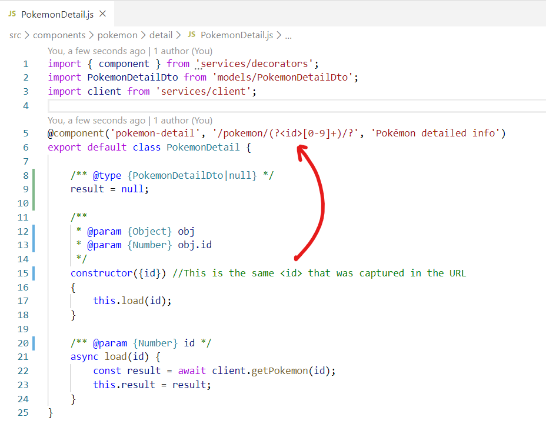

# Gulp, Babel, ES6, decorators, async/await, Vue.js, SCSS, Browserify, Live Reload, Source Maps, Pokemon demo
A quick experiment into modern JavaScript development with the MVVM pattern.

## Why it's cool
 * Simple ES6 classes, nicely decoupled from the rendering library (Vue.js in this case);
 * It uses the language capabilities: only public properties are exposed as data to the ViewModel (private ones are not);
 * Use of decorators to configure components and their route pattern;
 * Live reloading for improved productivity;
 * Pokémon, of course.

## Getting started
 * Open the console and then run `npm install`. This was developed on Node 12;
 * Then run `npm run build` (Ctrl+Shift+B on VSCode) to build the application or just run `npm run serve` to build and spawn a webserver;
 * Built output is in the `dist` directory.

## Debug
This project supports debugging with the [Debugger for Chrome Extension](https://marketplace.visualstudio.com/items?itemName=msjsdiag.debugger-for-chrome). Hit F5 on VSCode and start debugging.

## TODO
 * Event publishing and handling;
 * Computed properties;
 * Component properties;
 * Unit testing;
 * Dependencies cleanup.